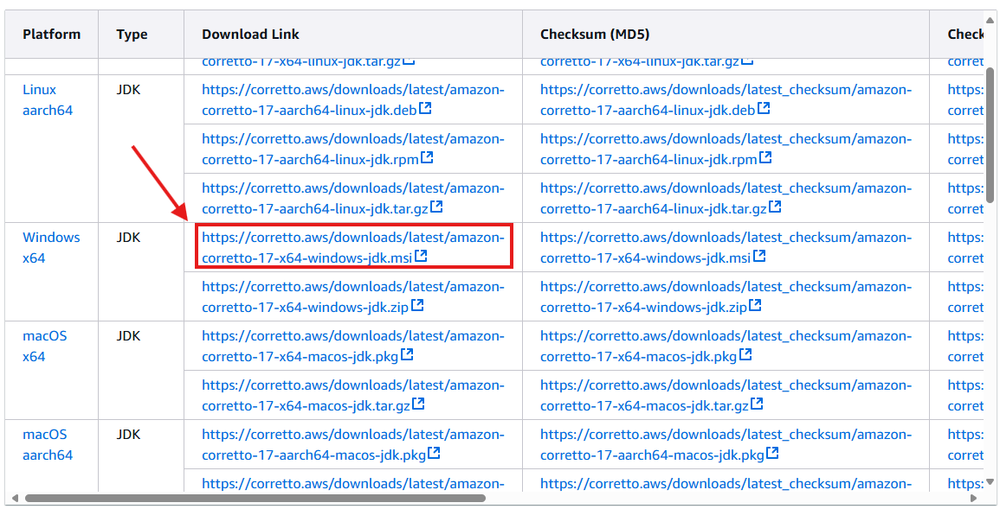

# Instalación de Amazon Corretto 17

## Paso 1: Descarga de Amazon Corretto 17

1. Visita la página oficial de Amazon Corretto: [Amazon Corretto Downloads](https://docs.aws.amazon.com/corretto/latest/corretto-17-ug/downloads-list.html)
2. Selecciona `Amazon Corretto 17`.
3. Elige la versión adecuada para tu sistema operativo (Windows, macOS, Linux).



## Paso 2: Instalación

### En Windows:
1. Descarga el instalador `.msi`.
2. Ejecuta el archivo descargado.
3. Sigue las instrucciones del instalador para completar la instalación.

### En macOS:
1. Descarga el archivo `.pkg`.
2. Ejecuta el archivo descargado.
3. Sigue las instrucciones del instalador.

## Paso 3: Verificación de la Instalación
1. Abre una terminal o línea de comandos.
2. Ejecuta el siguiente comando para verificar la instalación:
   ```bash
   java -version
   ```
   Deberías ver una salida que indica `Amazon Corretto 17`.

# Diferencias entre Amazon Corretto 17, OpenJDK 17, y Oracle JDK 17

| Característica           | Amazon Corretto 17       | OpenJDK 17             | Oracle JDK 17           |
|--------------------------|--------------------------|------------------------|-------------------------|
| **Licencia**             | Gratis, distribución LTS | Gratis, distribución LTS | Licencia comercial (para uso no personal) |
| **Soporte**              | Soporte a largo plazo (LTS) proporcionado por AWS | Soporte de la comunidad | Soporte a largo plazo (LTS) por Oracle (con suscripción) |
| **Actualizaciones**      | Actualizaciones regulares y seguridad de AWS | Actualizaciones de la comunidad | Actualizaciones con suscripción de Oracle |
| **Uso en producción**    | Certificado para uso en producción | Usado ampliamente en producción | Recomendado por Oracle para producción |
| **Plataformas soportadas** | Windows, macOS, Linux   | Windows, macOS, Linux  | Windows, macOS, Linux   |

Amazon Corretto es una distribución gratuita y certificada de OpenJDK con soporte a largo plazo proporcionado por AWS. Ofrece las mismas características y funcionalidades que OpenJDK, pero con mejoras adicionales de rendimiento y seguridad. Oracle JDK, por otro lado, es una versión comercial que requiere una suscripción para recibir actualizaciones de soporte y seguridad, aunque es gratuita para uso personal y de desarrollo.